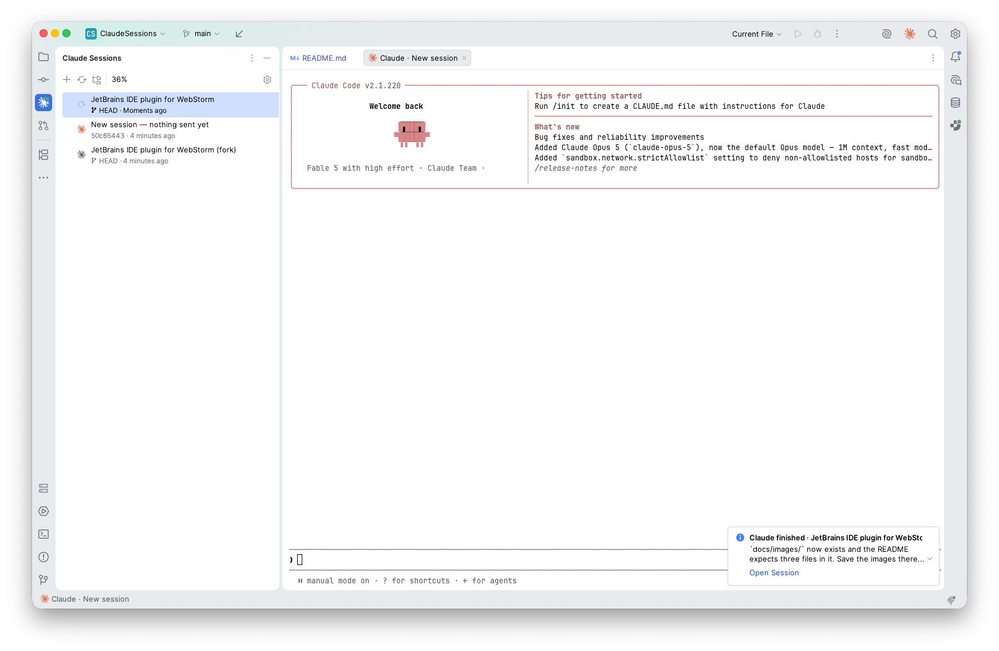
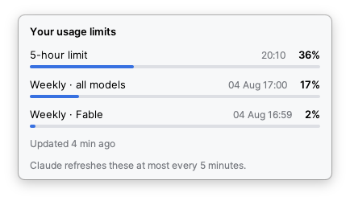

# Sessions for Claude Code

A WebStorm tool window that lists Claude Code sessions, shows which ones are running or
waiting for input, and opens any of them as an editor tab.

> **Unofficial.** Not affiliated with, endorsed by, or sponsored by Anthropic. Claude and
> Claude Code are trademarks of Anthropic, PBC.

- Sessions for the current project, or all projects grouped under collapsible project
  headings. A session run in a git worktree is listed under the project it was started
  for, marked with the worktree's name.
- Live status per session: an orange Claude mark when alive, a spinner while Claude is
  working, an attention icon when it wants input. The stripe icon gets a badge so you
  notice while the tool window is collapsed.
- Click a session to resume it in an **editor tab** (not the Terminal tool window).
  Clicking again focuses that tab. `+` starts a new session.
- Hover a session for a row menu with **Delete**, which moves it to
  `~/.claude/claudesessions/archive/` and offers Undo — no confirmation dialog, but nothing
  is destroyed either.
- **System notifications** when a turn ends or Claude needs input, each switchable on its
  own, and only for sessions running in this IDE's own tabs. macOS shows them only while the
  IDE is not the active application; inside the IDE they arrive as balloons.
- **Review notes in the diff viewer.** Hover a line in a side-by-side diff and a `+` appears
  beside the line number. Write what needs fixing, add as many notes across as many files as you
  like, then send the whole set to a session with one button — which always names the session it
  is about to send to. `Enter` adds a note, `Option+Enter` or `Cmd+Enter` starts a new line. The
  agent answers each note under the line it belongs to, in the language the note is written in;
  `×` closes a note, writing on it again reopens it and sends it back with its history. A note
  the agent never answered says so rather than pretending to be done.
- **Usage limits** in the toolbar: the 5-hour percentage, with a dropdown showing every
  window (5-hour, weekly all-models, weekly per-model).
- **Settings** under *Settings → Tools → Claude Sessions*, or the gear in the tool window:
  background fetch interval, and a switch to turn background fetching off entirely.

## Screenshots

The session list beside a session resumed in the main editor area rather than the Terminal
tool window. The selected row is working, so it shows a spinner; the others are alive and
show the orange Claude mark, with the git branch and last activity beneath each title. The
`+` button started the middle session, which was listed immediately and will be named once
Claude has something to call it. Bottom right is a turn-end notification, with the action
that jumps to the session it came from:



Usage limits, read from the payload Claude already caches rather than from the API — which is
why the popup is honest about how stale the figures may be:



Release notes are in [CHANGELOG.md](CHANGELOG.md).

## Requirements

- WebStorm 2026.2 (build 262+). Branch 262 requires a **Java 25** toolchain; Gradle
  provisions it automatically via the foojay resolver.
- Gradle 9.x — the wrapper is checked in, use `./gradlew`.

## Build and run

```bash
./gradlew test buildPlugin
```

Launch a sandbox IDE with the plugin installed:

```bash
./gradlew runIde
```

Install into your real WebStorm from `build/distributions/ClaudeSessions-<version>.zip`
via **Settings → Plugins → ⚙ → Install Plugin from Disk**.

> Close the sandbox IDE before rebuilding. `idea.auto.reload.plugins` hot-reloads the jar
> when it changes underneath a running instance, which can take the IDE down with it.

## How it works

Two data sources, joined on `sessionId`:

| Source | Provides |
|---|---|
| `~/.claude/projects/<encoded-cwd>/<sessionId>.jsonl` | title, cwd, git branch, last activity |
| `~/.claude/sessions/<pid>.json` | live status: `busy`, `shell`, `idle`, `waiting` |

Details that drive most of the implementation:

- **Project directory names are a lossy encoding of the cwd.** Every non-alphanumeric
  character becomes `-`, so `-Users-dev-projects-acme-apps-admin` is ambiguous. Sessions
  are matched to a project by the `cwd` recorded inside the transcript, never by decoding
  the directory name.
- **Transcripts reach 6.5 MB** with base64 images inline. `SessionIndexer` streams them and
  only parses short index records, caches on `(size, mtime)`, and rate-limits re-scanning so
  an actively appending transcript is not re-read on every poll.
- **Title records are rewritten in place**, so the *last* `custom-title` / `ai-title` wins.
- **A worktree session has its own transcript directory**, because the worktree is its cwd.
  Two mechanisms find them, because neither is sufficient alone:
  - Claude's `worktree-state` record carries `worktreeName` and `originalCwd`. `ProjectScope`
    finds those directories by the encoded marker `--claude-worktrees-`, which must follow the
    project's own prefix *immediately* — otherwise a parent claims its children's worktrees.
  - `GitWorktrees` reads `<project>/.git/worktrees/<name>/gitdir` for worktrees at arbitrary
    paths, which no directory name can identify. It also supplies the name for a session that
    merely ran in a worktree without Claude creating it. Read directly rather than by running
    `git worktree list`: no subprocess per refresh, and no dependence on git being on the PATH
    the IDE inherited.

  A worktree that has since been **deleted** is out of scope: git no longer registers it and
  its path no longer exists, so nothing can prove which project its transcripts belonged to.
  Those sessions remain reachable through the all-projects view.
- **Inherited `CLAUDE_CODE_*` markers break everything.** If the IDE was launched from a
  Claude Code session it carries `CLAUDE_CODE_CHILD_SESSION=1`, and the CLI then treats any
  session we spawn as a nested child: no transcript, no pid file, so the session is invisible
  to both the list and the status poller. `ClaudeEnvironment` blanks those markers, which is
  equivalent to unsetting them because the CLI maps `""` to false/undefined.
- **The pid file decides whether a session is alive; hooks decide what it is doing.** Every
  entrypoint writes `~/.claude/sessions/<pid>.json`, including non-interactive `-p` runs, but
  only the interactive TUI writes a `status` into it. So a Claude Desktop or agent-SDK session
  is known to be running and takes its state from hooks, falling back to alive-but-unknown
  rather than being given an invented one.

  Hooks are deliberately *not* evidence of life. They are a record of things that happened and
  have no event for "killed": a session interrupted mid-turn leaves a `UserPromptSubmit` with
  no `Stop` after it, which left a dead session spinning at the top of the list — and offering
  to resume "in another process (pid null)" — until the event log next rotated.

### Notifications

Driven entirely by hooks, because nothing else reports a turn *ending* — the pid file only
says what a session is doing now, and only for the interactive TUI. With hooks off, the
notification settings cannot fire and the settings page says so rather than looking broken.

The hook payload turns out to carry considerably more than the documented `session_id` and
`hook_event_name`, and that is what the notifications say:

| Field | Used for |
|---|---|
| `last_assistant_message` (on `Stop`) | the body of a turn-end notification |
| `message` (on `Notification`) | the title of a needs-input notification, in Claude's wording |
| `session_title` (on `SessionStart`, `UserPromptSubmit`) | naming the session |
| `stop_hook_active` (on `Stop`) | *suppressing* a notification |
| `transcript_path` | naming a session whose title was never announced |

Details that are not obvious:

- **`stop_hook_active` means the turn did not end.** A stop hook sent Claude back to work, so
  `Stop` fires again; announcing it would be false.
- **`idle_prompt` is not an ask.** It fires a minute after Claude stopped, so it would only
  repeat the turn-end notification, later. Only genuinely blocking types — permission prompts,
  plan approvals, elicitations — count as needing input.
- **`agent_completed` is a turn ending**, not an ask, which is the case where nobody is
  watching a terminal at all.
- **The log is history, not news.** It outlives an IDE run, so `HookEventBus` folds the first
  read into session state and announces none of it. Same when notifications are switched back
  on after a quiet spell: it skips to the end first, rather than announcing an hour of
  accumulated turns at once.
- **One reader, application-wide.** Two would each reset to the start when the other truncated
  the log and replay each other's events, and with several projects open the same session
  finishing would be announced once per window. A notification is attributed to the project
  whose tab is running the session, or failing that to the open project whose base path most
  closely contains the session's cwd.
- **Only this IDE's sessions, by default.** The log is one file per machine, so the desktop
  app, a plain terminal and every other IDE window all arrive here too. A session counts as
  this window's when one of its tabs is running it — plus a `+` tab that has not been matched
  to its session yet, which is recognised by its launch directory, or the first turn of every
  new session would be silent. A session opened as a copy, or through the background-agents
  view, keeps a synthetic tab id and is not recognised. Turn the filter off under
  **Settings | Tools | Claude Sessions** to hear about every Claude on the machine.
- **Claude has its own notifications** (`preferredNotifChannel`, `inputNeededNotifEnabled` in
  `~/.claude/settings.json`). If those already reach you, expect two for a needs-input event
  and turn one side off.

### Usage limits

Read from `cachedUsageUtilization` in `~/.claude.json` — the payload Claude already caches
for its own UI — so no API call and no credential handling. Two constants of Claude's are
mirrored rather than fought:

- It **will not rewrite that cache** while the entry is under five minutes old; it fetches
  and discards. Refreshing inside that window is skipped rather than wasted.
- It discards its own copy after an hour, so older readings are shown as stale rather than
  presented as current.

Refreshing runs Claude's own `/usage`, which needs `CLAUDE_CODE_SKIP_PROMPT_HISTORY=1` —
without it every refresh leaves a session transcript behind. `CLAUDE_CODE_CHILD_SESSION`
does *not* work for this: it only applies to interactive sessions, so `-p` ignores it.

A refresh costs ~2s and a ~437MB process spike but **no tokens** — `/usage` is a local
command hitting a config endpoint, not a model turn. Background fetching defaults to every
ten minutes while the tool window is visible, is configurable, and can be switched off; the
interval is clamped to the five-minute floor on read as well as in the UI, so a hand-edited
`claudeSessions.xml` cannot make it useless. Opening the dropdown always fetches on demand,
whatever the background setting says.

Terminals are hosted in our own `FileEditor` rather than via the platform's
`Terminal.MoveToEditor`, whose virtual file is Kotlin-internal and whose sessions are
terminated when the tab is dragged ([IJPL-165734](https://youtrack.jetbrains.com/issue/IJPL-165734),
fixed only in 2026.2.1).

## Layout

```
data/SessionIndexer.kt          transcript → SessionSummary (streaming, cached)
data/LiveSessionWatcher.kt      pid files → LiveStatus (validated against ProcessHandle)
data/SessionStore.kt            project service; merges both into a StateFlow
ui/ClaudeSessionsPanel.kt       the tree, its refresh strategy, and open/focus
ui/ProjectGroup.kt              grouping and ordering for the all-projects view
ui/SessionTreeCellRenderer.kt   project headings and two-line session rows
ui/SessionStateIcons.kt         single source of truth for status icons
ui/StripeBadge.kt               badges the stripe icon when a session needs attention
terminal/ClaudeTerminalLauncher.kt  open / focus a tab, adopt '+' sessions, sync icons
terminal/ClaudeEnvironment.kt   scrubs inherited Claude session markers
hooks/HookEventBus.kt           the single tail of the hook log; state and events
hooks/SessionTitles.kt          what Claude calls each session, as the hooks mention it
notify/SessionNotice.kt         which events are worth announcing, and what they say
notify/SessionNotifier.kt       posts the OS notification and the IDE balloon
hooks/                          push status for every entrypoint, not just terminals
review/ReviewDiffExtension.kt   attaches the gutter and the send button to a diff viewer
review/ReviewEditorSession.kt   what the review draws in one editor, and its rediff handling
review/ReviewStore.kt           the notes, in workspace.xml; the one source of truth
review/ReviewAnchoring.kt       follows a note to where its line ended up
review/ReviewFile.kt            the markdown a round hands to the agent, including how to reply
review/ReviewSender.kt          writes the round, gates on session state, types the prompt
review/ReviewReplyWatcher.kt    reads the replies file and decides when a round is over
usage/                          usage limits: read, refresh, format, render
settings/                       persisted settings and the Settings page
data/SessionArchiver.kt         move a session out of history, reversibly
data/SessionStopper.kt          terminate a running session, refusing recycled pids
data/ProjectScope.kt            which sessions belong to a project, worktrees included
data/SessionPlaceholders.kt     rows for live sessions with no transcript yet
```

## Known limitations

- An editor terminal tab **does not survive an IDE restart**. `LightVirtualFile` uses a
  `mock://` URL the platform cannot resolve, so the tab vanishes rather than reopening
  broken. The platform's own terminal-in-editor has the same problem
  ([IJPL-107495](https://youtrack.jetbrains.com/issue/IJPL-107495)). Sessions stay resumable
  from the list.
- Splitting a session tab is blocked by design (`FORBID_TAB_SPLIT`): a Swing component has
  one parent, so two editors over one terminal view would tear the first apart.
- Adopting a `+` session matches on cwd, entrypoint and start time rather than a real handle,
  so starting a session manually in the same directory at the same moment could in principle
  be mis-attributed.
- **OS notifications cannot be verified from `runIde`.** The sandbox is a bare JVM with no
  application bundle, and `NSUserNotificationCenter` — which the platform uses — attributes
  notifications by bundle identifier. Everything up to the hand-off is exercised there; the
  banner itself only appears from an installed WebStorm.
- A session running in a worktree outside its project matches no open project by path, so
  unless one of its tabs is running it, its notification arrives without the *Open Session*
  action.
- A session opened as a **copy** of another, or through the **background-agents** view, keeps a
  synthetic tab id, so this IDE does not recognise it as its own. While notifications are
  filtered to this IDE's sessions — the default — those two stay silent.

## Licence

[MIT](LICENSE).

The plugin icon is the [Claude AI symbol](https://commons.wikimedia.org/wiki/File:Claude_AI_symbol.svg)
from Wikimedia Commons, released under
[CC0 1.0](https://creativecommons.org/publicdomain/zero/1.0/) — public domain, no attribution
required. It is reproduced here to identify what the plugin works with, not to suggest that
Anthropic produced or endorsed it.
